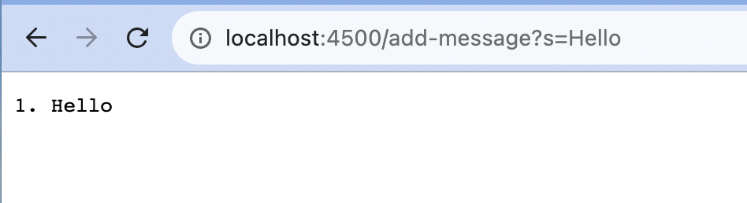
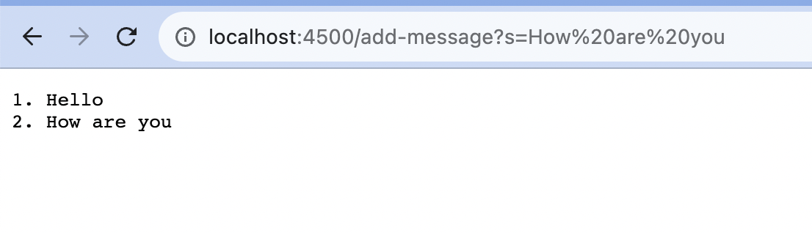

# Lab Report 2
## Part 1
### Code
```java
import java.io.IOException;
import java.net.URI;

class Handler implements URLHandler {
    // The one bit of state on the server: a number that will be manipulated by
    // various requests.
    String str = "";
    int num = 0;
    public String handleRequest(URI url) {
        if (url.getPath().equals("/")) {
            return str;
        } else {
            if (url.getPath().contains("/add-message")) {
                String[] parameters = url.getQuery().split("=");
                if (parameters[0].equals("s")) {
                    num++;
                    str += num+". "+parameters[1]+"\n";
                    return str;
                }
            }
            return "404 Not Found!";
        }
    }
}

class StringServer {
    public static void main(String[] args) throws IOException {
        if(args.length == 0){
            System.out.println("Missing port number! Try any number between 1024 to 49151");
            return;
        }

        int port = Integer.parseInt(args[0]);

        Server.start(port, new Handler());
    }
}
```
### Output 1

The methods that are called are handleRequest(), getPath(), equals(), contains(), getQuery(), and split(). 
The relevant arguments are "http://localhost:4500/add-message?s=Hello", "/", "=", "s". 
The url changes to "http://localhost:4500/add-message?s=Hello", "/", "=", "s". The int variable num changes from 0 to 1, String str changes from "" to "1. Hello \n". 

### Output 2

The methods that are called are handleRequest(), getPath(), equals(), contains(), getQuery(), and split(). 
The relevant arguments are "http://localhost:4500/add-message?s=How%20are%20you", "/", "=", "s". 
The url changes to "http://localhost:4500/add-message?s=How%20are%20you". The int variable num changes from 1 to 2, String str changes from "1. Hello \n" to "1. Hello \n2. How are you\n". 

## Part 2
### Path to Private Key


### Path to Public Key


### Login without Password


## Part 3
In week 2 lab I learned how to run a server using the code being provided. I was able to manipulate the path and query to make the URL do different things. I also learned what is a port. In week 3 lab, I learned that scp means secure copy and it basically downloads files between remote host and local host, or between remote and remote hosts. I also learned mdkir which makes a directory. 

